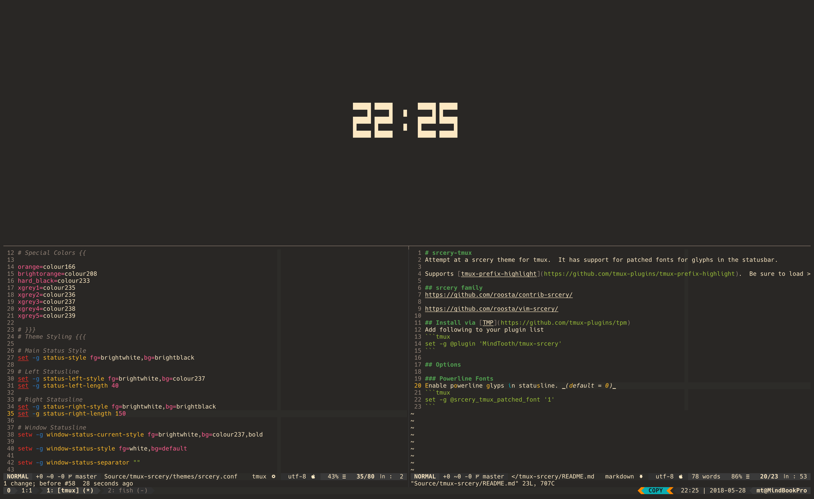

# srcery-tmux



tmux theme for the [srcery](https://github.com/srcery-colors/) color scheme.


## Features
* Support for powerline glyphs via patched font.
* [tmux-prefix-highlight](https://github.com/tmux-plugins/tmux-prefix-highlight).  _(Be sure to load this after you have loaded your theme either via `run-shell` or [TPM](https://github.com/tmux-plugins/tpm).)_

## Installation
### Manually (Using `git` & `run-shell`)
```shell
git clone https://github.com/srcery-colors/srcery-tmux/ ~/.tmux/themes/srcery-tmux
```
Then add the folling to your `.tmux.conf` file:
```tmux
run -b ~/.tmux/themes/srcery-tmux/srcery.tmux
```
### [TPM](https://github.com/tmux-plugins/tpm)
Add following to your plugin list:
```tmux
set -g @plugin 'srcery-colors/srcery-tmux'
```

## Options

### Powerline Fonts
Enable powerline glyps in statusline. _(default = 0)_
```tmux
set -g @srcery_tmux_patched_font '1'
```

## Inspiration
* [Nord tmux](https://github.com/arcticicestudio/nord-tmux)
* [tmux-themepack](https://github.com/jimeh/tmux-themepack)
